# Elastic Beanstalk Deploy Tutorial

***
# Introdução
Para realizar o deploy de uma aplicação em um ambiente do Elastic Beanstalk na AWS é preciso alterar as permissões no IAM e criar algumas funções para atribuir às instâncias EC2 e ao Beanstalk propriamente dito.

# Função IAM
A função IAM que utilizei foi criada da seguinte maneira: 
- Acesse a página da IAM
- Selecione Funções e selecione para criar uma nova função
- Siga o passo a passo a seguir:

  
- Selecione a entidade confiável da seguinte maneira:
  
- Adicione as seguintes políticas:
  ```
  AmazonEC2FullAccess
  AmazonEC2ContainerServiceforEC2Role
  AWSElasticBeanstalkWebTier
  AWSElasticBeanstalkWorkerTier
  AWSElasticBeanstalkMulticontainerDocker
  AmazonEC2ContainerServiceAutoscaleRole
  AmazonEC2SpotFleetAutoscaleRole
  AutoScalingFullAccess
  ```
- Adicione um nome que fique fácil de você achar a função depois:
  
- Confira que as permissões estão desta maneira após você adicioná-las, e em seguida clique em cirar função:
  
- Confira também após a criação:
  
***
# Security Group 
Eu utilizo dois grupos de segurança para atribuir às instâncias EC2, porém você pode mesclar os dois em apenas um com as seguintes regras de entrada e saída:

***
# Criação do arquivo a ser feito o deploy
Para realizar o deploy de uma aplicação, é necessário criar o arquivo .zip (NÃO PODE SER .RAR OU OUTROS) do projeto. Para isso, é preciso selecionar todas as pastas e arquivos diretamente e compactá-las para zip, da seguinte maneira:
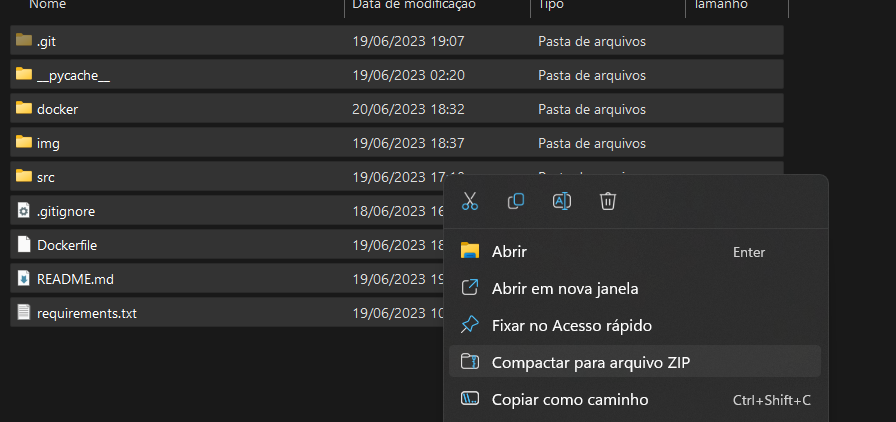

- Note que para subir uma aplicação Docker, a Dockerfile deve estar visível na primeira pasta do zip a ser criado. Ela não pode estar em alguma subpasta ou em outro caminho.
***
# Criação do ambiente EBS e deploy
Para criar o ambiente propriamente dito, basta ir na aba do Elastic Beanstalk na AWS e começar a criar um domínio e seguir os seguintes passos:

## Etapa 1
- Siga as especificações relatadas nas imagens:
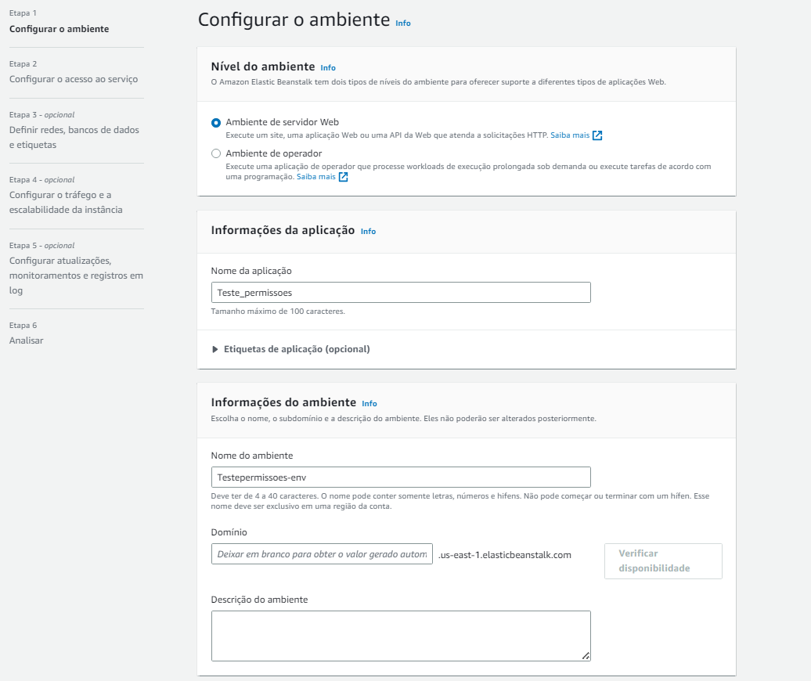
- Aqui é onde você vai escolher qual plataforma você estará rodando o seu código que realizará o deploy:
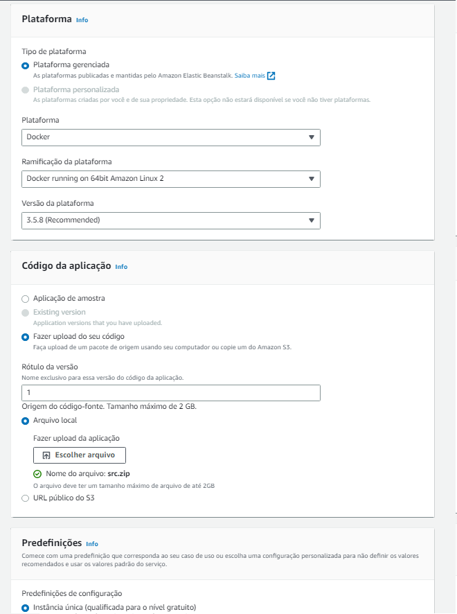
- Após aqui, clique em próximo para avançar à próxima etapa.

## Etapa 2
- Nessa etapa, selecione a função IAM que foi criada anteriormente, juntamente com um par de chave para instâncias EC2.
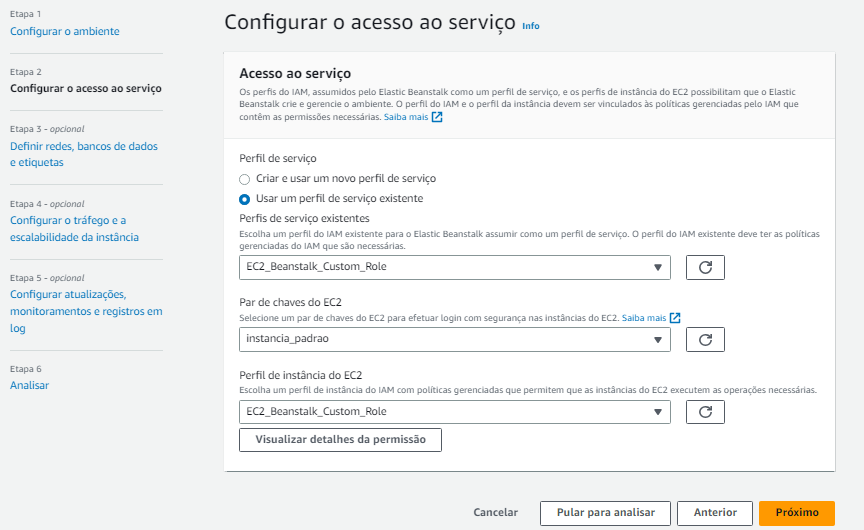

## Etapa 3
- Selecione sua VPC e configure da seguinte maneira:
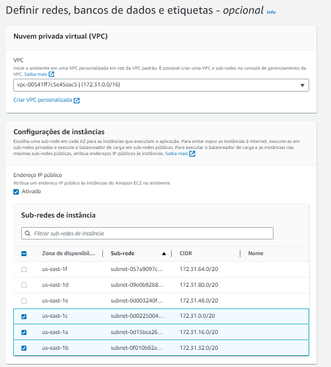
- Deixe o banco de dados desativado desta maneira:
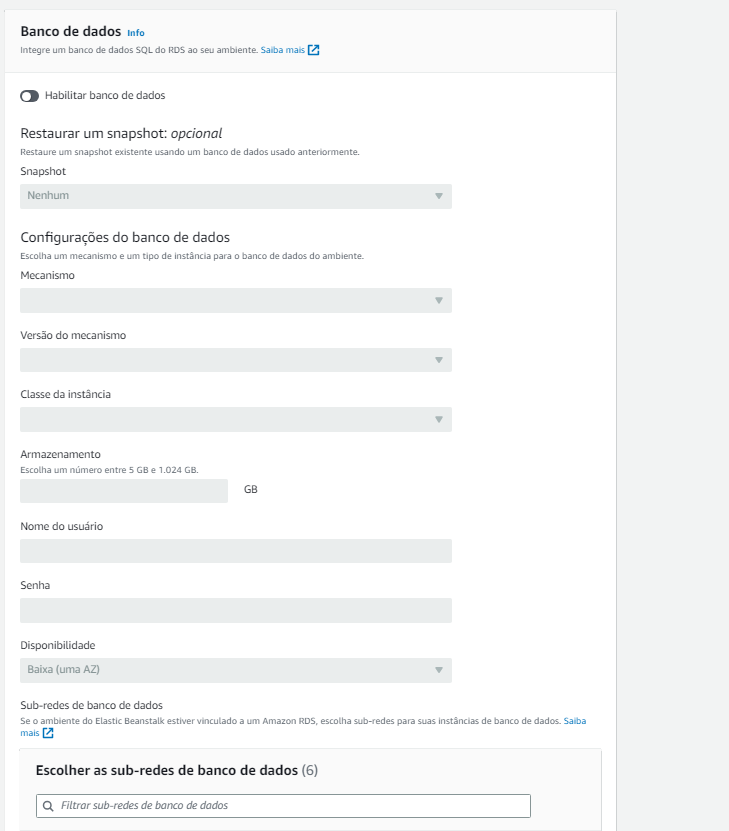
- Adicione as Tags necessárias das instâncias EC2:
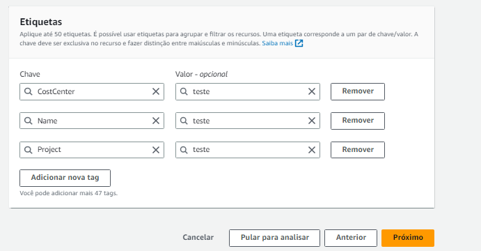

## Etapa 4
- Configure esta parte dessa forma:

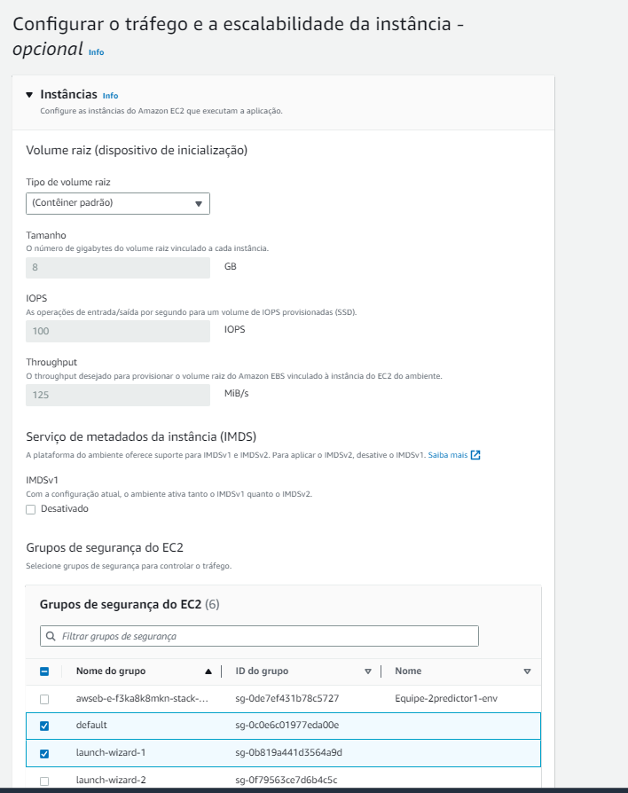

- Tenha certeza de que o tipo de instância selecionado é t2.micro:

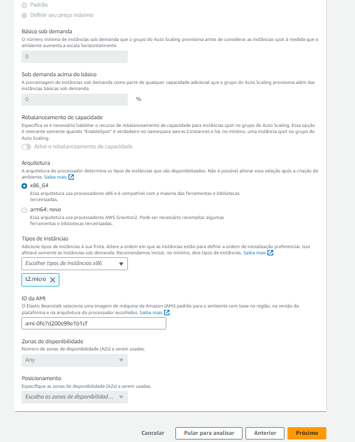

## Etapa 5
- Configure da seguinte maneira:

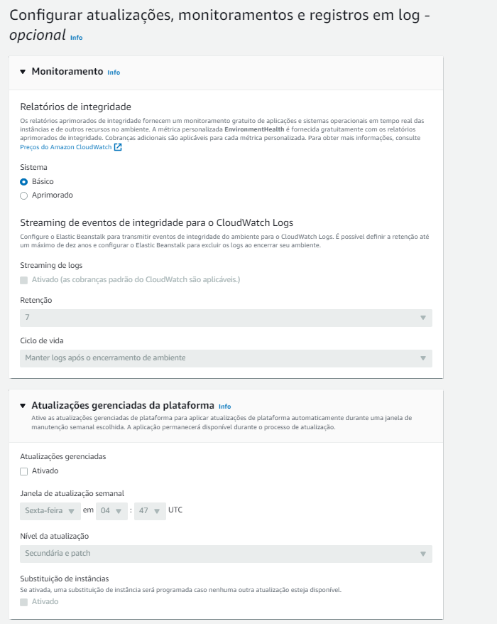

- Se quiser acompanhar de perto, adicione seu email no campo de email e continue a configuração como nas imagens:

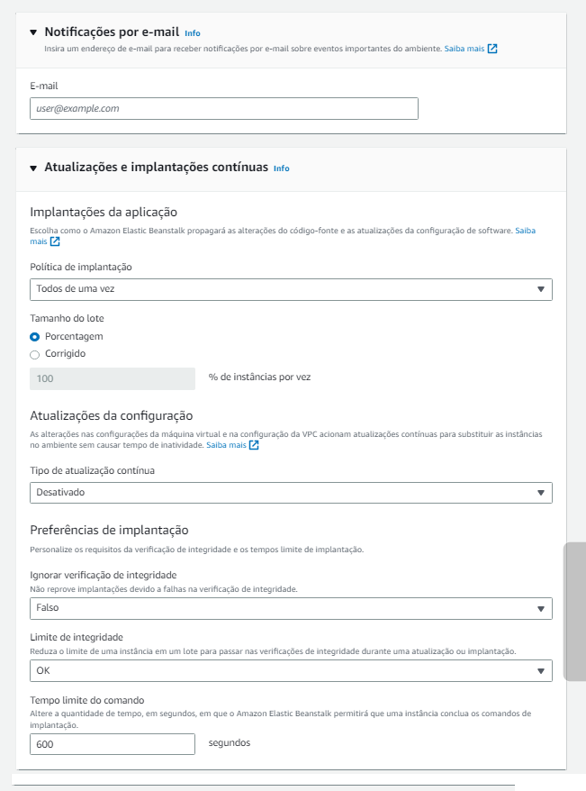

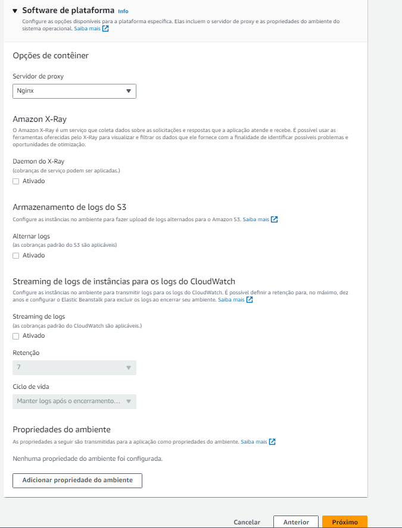

## Etapa 6
- Revise o final da configuração e se tudo estiver conforme citado, finalize a criação e espere cerca de 10 a 15 minutos para seu ambiente ser criado, juntamente da EC2 e o link elástico.

# Testando o seu deploy
- Uma vez que o deploy foi realizado e se estiver da seguinte maneira, com os logs dessa forma, clique no link no campo "Domínio" e teste sua rota!

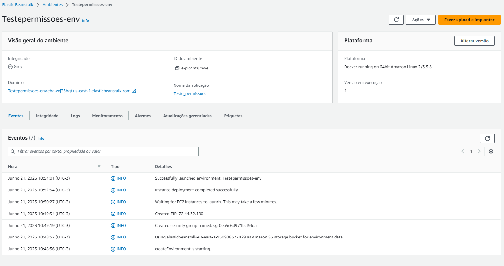
