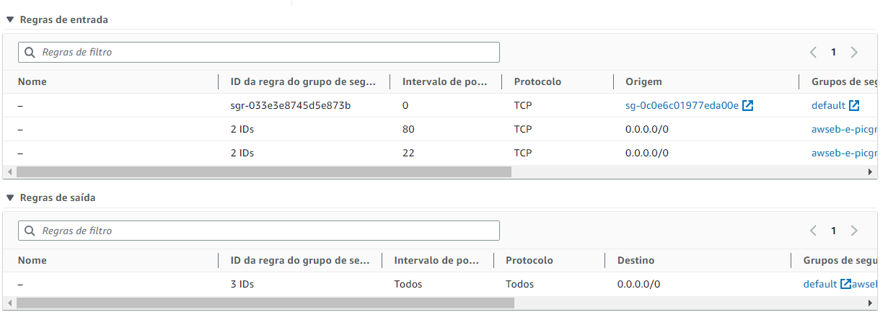

# Elastic Beanstalk Deploy Tutorial

***
# Introdução
Para realizar o deploy de uma aplicação em um ambiente do Elastic Beanstalk na AWS é preciso alterar as permissões no IAM e criar algumas funções para atribuir às instâncias EC2 e ao Beanstalk propriamente dito.

# Função IAM
A função IAM que utilizei foi criada da seguinte maneira: 
- Acesse a página da IAM
- Selecione Funções e selecione para criar uma nova função
- Siga o passo a passo a seguir:

  
- Selecione a entidade confiável da seguinte maneira:
  
- Adicione as seguintes políticas:
  ```
  AmazonEC2FullAccess
  AmazonEC2ContainerServiceforEC2Role
  AWSElasticBeanstalkWebTier
  AWSElasticBeanstalkWorkerTier
  AWSElasticBeanstalkMulticontainerDocker
  AmazonEC2ContainerServiceAutoscaleRole
  AmazonEC2SpotFleetAutoscaleRole
  AutoScalingFullAccess
  ```
- Adicione um nome que fique fácil de você achar a função depois:
  
- Confira que as permissões estão desta maneira após você adicioná-las, e em seguida clique em cirar função:
  
- Confira também após a criação:
  
***
# Security Group 
Eu utilizo dois grupos de segurança para atribuir às instâncias EC2, porém você pode mesclar os dois em apenas um com as seguintes regras de entrada e saída:

***
# Criação do arquivo a ser feito o deploy
Para realizar o deploy de uma aplicação, é necessário criar o arquivo .zip (NÃO PODE SER .RAR OU OUTROS) do projeto. Para isso, é preciso selecionar todas as pastas e arquivos diretamente e compactá-las para zip, da seguinte maneira:
